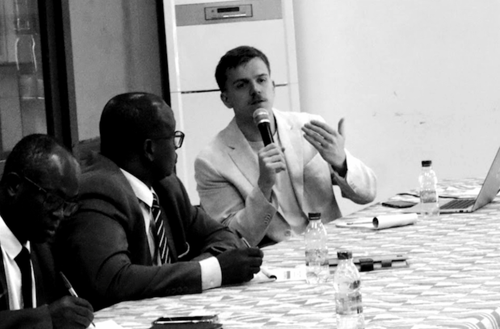

+----------------------------------------+--------------------------------------------------------------------------------+
|  | 47 bd. Vauban 78047 Guyancourt Cedex                                           |
|                                        |                                                                                |
|                                        | Email: alexandre.mathieu\@uvsq.fr                                              |
|                                        |                                                                                |
|                                        | [ORCID](https://orcid.org/0009-0009-6720-8731)                                 |
|                                        |                                                                                |
|                                        | [HAL CV](https://cv.hal.science/alexandre-mathieu-ln)                          |
|                                        |                                                                                |
|                                        | [LinkedIn](https://www.linkedin.com/in/alexandre-mathieu-28100519a/)           |
|                                        |                                                                                |
|                                        | [GitHub](https://github.com/AMathieuLN)                                        |
|                                        |                                                                                |
|                                        | [Google Scholar](https://scholar.google.com/citations?user=JjBuFXsAAAAJ&hl=fr) |
+----------------------------------------+--------------------------------------------------------------------------------+

## **Postdoctoral researcher**

I am a postdoctoral researcher at the Joint International Unit for Sustainability and Resilience - UMI SOURCE (Paris-Saclay University, UVSQ, IRD).

I am a **political economist** working on development, labour, sustainability, data and scientific production. My research mainly examines **two labour markets in the Global south**: **green jobs** in the context of socio-ecological transitions, and **scientific work** **and production** in social sciences and environmental sciences.

I completed my PhD in Economics at **Paris-Saclay University**, in September 2025. My broader research exprience also includes socio-**economic project evaluation**, **small island economies** and the valuation of **ecosystem services**.

## Current positions

-   *Since 10/2025:* Postdoctoral researcher UMI SOURCE (Paris-Saclay University, UVSQ, IRD).
-   *Since 2026:* Member of the Scientific Committee of the Paris-Saclay Open University Press (POPS).
-   *Since 2024:* Associate Editor of **Development and Sustainability in Economics and Finance ([DSEF](https://www.sciencedirect.com/journal/development-and-sustainability-in-economics-and-finance/))**.
-   *Since 2024:* Curator and administrator of scientific data for UMI SOURCE and the [**DataSuds**](https://dataverse.ird.fr/dataverse/umi_source/) platform of the **French National Research Institute for Sustainable Development** (**IRD**).

**Past positions**

-   *2022–2024:* Doctoral students’ representative at the **Doctoral School of Law, Economics, Management (DEM), University of Paris-Saclay**.
-   *2022–2024:* Doctoral students’ representative at **UMI SOURCE**.

## Education and Qualifications

-   *2026:* Associate Professor Qualification in [Economics]{.underline} (Section 5), **CNU**
-   *2021 - 2025:* PhD in [Economics]{.underline} at **UMI SOURCE** **(Université Paris-Saclay, UVSQ, IRD)**
-   *2019 - 2021:* Master's in [Political Economy and Institutions]{.underline} at the **Université Paris-Saclay**, specializing in Economics and Evaluation of Development and Sustainability ([EEDS](https://www.universite-paris-saclay.fr/formation/master/economie-politique-et-institutions/m2-economie-et-evaluation-du-developpement-et-de-la-soutenabilite))
-   *2016 - 2019:* Bachelor's in [Philosophy]{.underline} at **Sorbonne Université**
-   *2015 - 2018:* Bachelor's in [Sociology]{.underline} at the **Université Versailles-Saint-Quentin-en-Yvelines**
